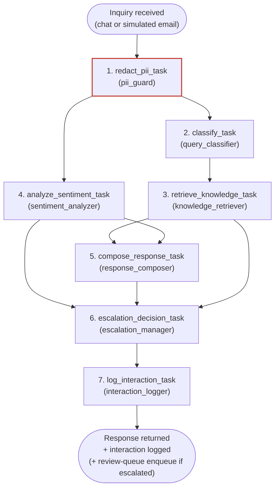
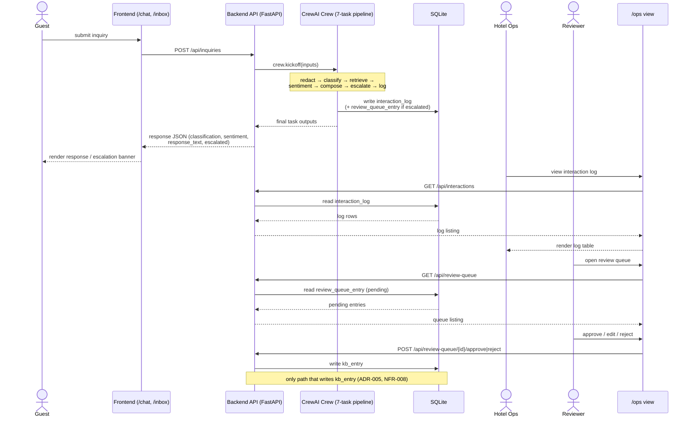
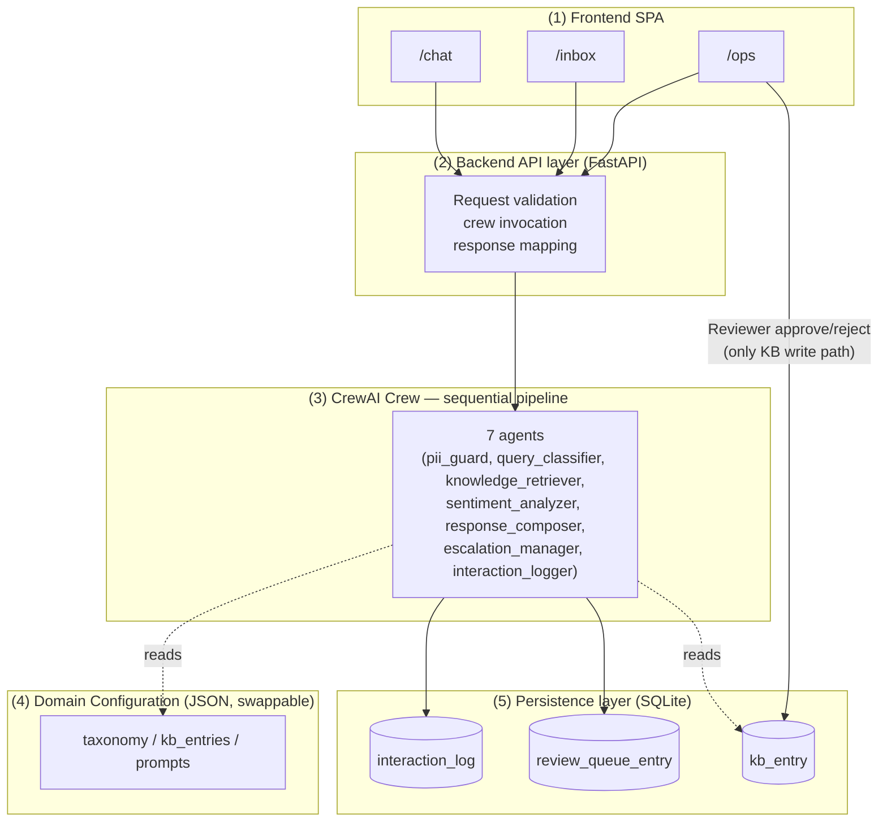
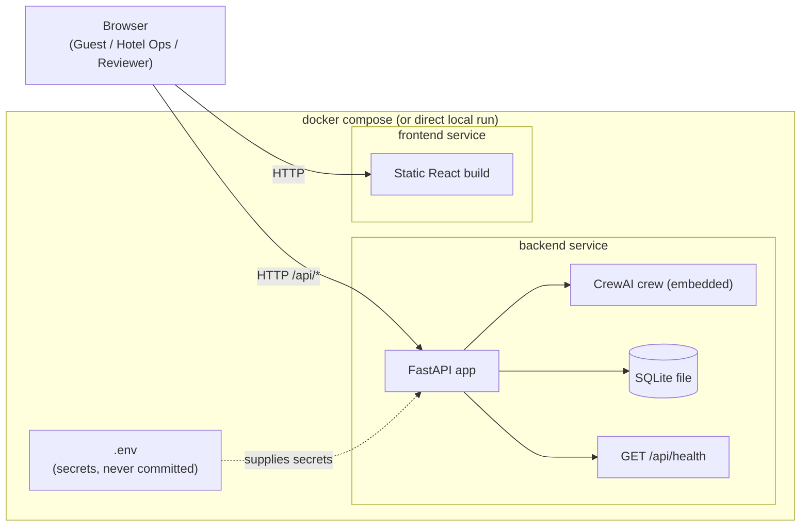
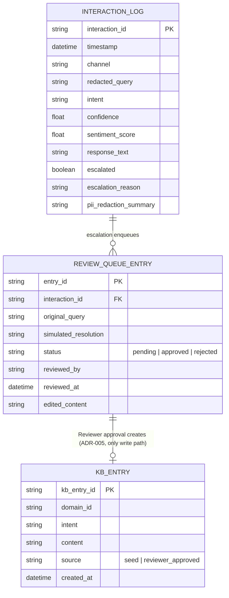

# AAMAD MVP System Architecture Document (SAD) Template

## Context & Instructions
Generate a system architecture specification for a multi-agent MVP.
Align agent and API design with the runtime selected via `AAMAD_TARGET_RUNTIME` (`crewai` | `claude-agent-sdk` | `cursor-sdk`) and the active adapter rule.
Frontend stack defaults to a modern web chat UI when the PRD does not specify otherwise; do not hardcode a single vendor UI library as mandatory unless the PRD/SAD decisions require it.
This document is the blueprint for Build-phase personas. Prefer lean MVP views; defer nonessential NFRs to Future Work.

## Input Requirements

**PRD Document**: `project-context/1.define/prd.md`
**MRD** (optional): N/A — not commissioned (internal/portfolio project; see `prd.md` §"Input Requirements" and Assumptions). See this document's Assumptions/Open Questions for the resulting architectural risk.
**User Stories** (when present): N/A — no `project-context/1.define/user-stories/` directory exists at time of writing. Traceability below uses PRD/system-description FR/NFR/AC IDs instead. See Open Questions.
**MVP Scope**: Focus on core value proposition (80/20) — the four in-scope Hotel/Hospitality scenario categories (reservations & booking, check-in/check-out & billing, room service & amenities, general complaints) across chat and simulated email, with PII redaction and human-curated KB feedback loop as first-class MVP concerns (not deferred).
**Selected Runtime**: crewai

## System Architecture Specification — Generate All Sections

### 1. MVP Architecture Philosophy & Principles

**MVP Design Principles**:

- **Context-first, explainable by construction**: every response must be traceable to its inputs (classification, retrieved KB snippet(s), sentiment score) — mirrors PRD §6 "Agent Interaction Design" and satisfies NFR-003 (Observability) and AC-004.
- **Domain-agnostic core, config-driven specialization**: core CrewAI agent/task code contains no domain-specific strings or logic; all taxonomy, KB content, and prompts are supplied by an external, schema-validated JSON domain configuration (FR-012, FR-013, NFR-007, AC-008, AC-009). This is the single most important architectural constraint in this SAD — see ADR-001.
- **Human-in-the-loop for KB integrity**: no code path allows an agent to write to the live knowledge base. Candidate entries flow through a review queue; only the Reviewer persona's explicit approve/edit/reject action can update the KB (FR-014, NFR-008, AC-010, AC-011) — see ADR-005.
- **Privacy-by-default**: PII detection/redaction is a mandatory pipeline step before any content is logged or sent to retrieval/LLM components, not an optional add-on (FR-011, NFR-004, NFR-006, AC-007) — see ADR-004.
- **Minimal viable agent set and simplest orchestration that delivers core value**: one shared CrewAI crew, one `crew.kickoff()` per inquiry, sequential process — see ADR-002.
- **Observable by default**: every interaction is logged (query, classification, sentiment, outcome, PII actions) to a locally inspectable store (NFR-003, NFR-006, AC-004).
- **Automated deploy scaffolding from day 1 when Deliver phase is in scope**: deferred to `@devops.eng` per PRD §8 Phase 3; hosting target is an explicit Open Question here (not decided by this SAD).

**Core vs Future Features**:

- **MVP** (P0, from PRD §4): chat intake + classification; knowledge-grounded response generation; sentiment-aware tone/escalation; simulated escalation; simulated email channel sharing the chat pipeline; PII redaction; domain-configurable Hotel/Hospitality content; human-curated KB feedback loop (record candidate → Reviewer approve/edit/reject).
- **MVP** (P1): interaction logging of every processed inquiry.
- **Future** (P2, explicit exclusions mirrored from PRD §4/system-description §8):
  - Real helpdesk/CRM integration (Zendesk, Freshdesk, ServiceNow, Salesforce, etc.)
  - Real email server integration (SMTP/IMAP, deliverability, spam/abuse handling)
  - Live, continuously ingested knowledge base / vector store
  - Fully autonomous (unreviewed) self-learning
  - Voice and social-media channels
  - Enterprise-scale load handling and formal SLA guarantees
  - Authentication, multi-tenancy, formal regulatory certification (GDPR/HIPAA audit, DPA agreements)
  - Fully built-out domain configurations for other verticals; multi-domain simultaneous operation

**Technical Architecture Decisions**:

- **Frontend framework**: PRD does not mandate a specific frontend framework/library (§6 only specifies "single-page web chat widget plus a simple simulated inbox view", web-only). This SAD selects a lightweight React + Vite single-page app (see ADR-006) as the justified default — minimal build tooling, fast iteration for a 5-week single-developer timeline, no SSR/SEO requirement since this is an internal demo, not a public site.
- **UI approach for human-agent interaction**: two logical surfaces in one SPA — (1) guest-facing chat widget + simulated inbox view, (2) ops-facing internal log/review view (interaction log + KB review queue with approve/edit/reject actions gated to the Reviewer persona). No authentication for MVP (Out of Scope per PRD §5/system-description §8), so the ops view is reachable but not access-controlled — recorded as a security risk/Open Question, not silently accepted.
- **Runtime-specific agent communication pattern**: CrewAI sequential process with a shared context object (crew inputs dict) carrying `inquiry`, `channel`, `detected_intent`, `kb_snippets`, `sentiment_score`, `pii_redacted_content`, `escalation_flag` across tasks, chained via `Task.context` — see ADR-002 and §2.
- **Streaming vs non-streaming**: non-streaming for MVP. NFR-002 targets "within a few seconds end-to-end", which does not require token-level streaming; a single synchronous (or polled-async) request/response per inquiry keeps the backend contract simple — see ADR-003. Streaming is noted as a Future Work UX enhancement.

### 2. Multi-Agent System Specification

**Agent Architecture Requirements**:

The PRD's Core Agent Definitions table (§3) specifies six agents. This exceeds the template's "3–4 specialized agents maximum for MVP" guidance; this SAD deliberately retains all six because each maps to a distinct Must-priority FR and a distinct reasoning responsibility (classification, retrieval, sentiment, composition, escalation policy, PII protection) — collapsing any of them would blur the domain-agnostic/config-driven boundary (FR-012) or the PII-safety boundary (FR-011). See ADR-007 for the explicit deviation rationale. The KB-write step is intentionally NOT an agent (see below) to preserve NFR-008.

| Agent (CrewAI `Agent`) | Role | Goal | Tools | Memory/session | PRD Trace |
|---|---|---|---|---|---|
| `pii_guard` | PII Redaction Guard | Detect and redact/mask PII before any content reaches retrieval, LLM composition, or logs | `pii_detector` tool (regex/NER-based, domain-config-independent) | None (stateless per inquiry) | FR-011, NFR-004, NFR-006, AC-007 |
| `query_classifier` | Support Query Classifier | Classify the (redacted) inquiry into a domain-configured intent/category | `taxonomy_lookup` tool (reads active domain config only) | None | FR-002, FR-012, AC-001, AC-008 |
| `knowledge_retriever` | Knowledge Base Retrieval Specialist | Retrieve grounding KB content for the classified intent | `kb_search` tool (reads active domain config's KB path) | None | FR-003, FR-012, FR-013, AC-001, AC-003, AC-008 |
| `sentiment_analyzer` | Guest Sentiment Analyst | Score sentiment/frustration in the (redacted) inquiry | `sentiment_scorer` tool | None | FR-004, AC-002 |
| `response_composer` | Response Composer | Compose a tone-adjusted response from classification + retrieved KB + sentiment; must not fabricate when no KB match | LLM only, no tools | None | FR-005, AC-001, AC-003 |
| `escalation_manager` | Escalation Manager | Decide and simulate handoff to a human when confidence is low or sentiment is highly negative; flag clearly | `escalation_flagger` tool | None | FR-006, AC-002, AC-003 |
| `interaction_logger` | Interaction & Review-Queue Logger | Log every interaction (query, classification, sentiment, outcome, PII actions); on escalation, record the simulated human resolution and queue it as a candidate KB entry | `interaction_log_writer`, `review_queue_writer` tools | None | FR-007, FR-008, NFR-003, NFR-006, AC-004, AC-010 |

Explicitly **not** an agent: the KB-approval step. Per FR-014/NFR-008, only the human Reviewer (via the ops UI, outside the crew) can promote a candidate review-queue entry into the live KB. No agent — including `interaction_logger` — has KB write access; it only enqueues candidates. This is the architectural control that satisfies AC-011.

**Task / Turn Orchestration**:

- **Dependency/execution flow** (one `crew.kickoff()` per inquiry, chat or simulated email — FR-009/FR-010 share the pipeline):
  1. `redact_pii_task` (`pii_guard`) — runs first on the raw inquiry; all downstream tasks and logs consume only the redacted form.
  2. `classify_task` (`query_classifier`) — depends on (1); context = redacted inquiry.
  3. `retrieve_knowledge_task` (`knowledge_retriever`) — depends on (2); context = classified intent + domain config KB path.
  4. `analyze_sentiment_task` (`sentiment_analyzer`) — depends on (1); can run logically parallel to (2)/(3) but executed in sequence per ADR-002; context = redacted inquiry.
  5. `compose_response_task` (`response_composer`) — depends on (2), (3), (4); context = intent + KB snippets + sentiment score.
  6. `escalation_decision_task` (`escalation_manager`) — depends on (3), (4), (5); context = KB match confidence + sentiment score + composed response; outputs `escalation_flag` and, if true, a simulated handoff message.
  7. `log_interaction_task` (`interaction_logger`) — depends on all prior tasks; always runs; writes the interaction log entry and, if escalated, writes a candidate review-queue entry (FR-008/AC-010).
- **Expected outputs/data formats**: each task returns a structured (Pydantic/JSON) output — `RedactionResult`, `ClassificationResult`, `KBRetrievalResult`, `SentimentResult`, `ComposedResponse`, `EscalationDecision`, `LogEntry` — validated before being placed in the shared crew context, per adapter-crewai.md Quality Gates ("validate required template headings"/output contracts analog for runtime tasks).
- **Context passing**: CrewAI `Task.context` chaining (explicit list of upstream tasks per adapter-crewai.md "Mapping"), not implicit shared memory — keeps dependency flow deterministic and auditable.
- **Error handling, retries, cancellation/timeout**:
  - Per-task `max_retry_limit >= 2` (adapter-crewai.md baseline).
  - If `knowledge_retriever` returns no match, `response_composer` MUST NOT fabricate an answer (AC-003) — it returns a "no grounded answer" signal that forces `escalation_manager` to flag escalation.
  - If `pii_guard` fails/errors, the pipeline halts for that inquiry rather than risk logging/forwarding unredacted PII (fail-closed on the privacy boundary) — the UI surfaces a generic "unable to process, please try again" message; this is a fail-closed design decision, not a silent failure.
  - Overall crew execution timeout aligned to NFR-002 ("a few seconds"); a hard ceiling (e.g., `max_execution_time`) is set at the crew level so a stuck run degrades to a simulated escalation rather than hanging indefinitely — exact seconds value deferred to `@backend.eng` tuning, recorded here as an Open Question.
- **Performance budgets**: `max_iter <= 12` per task per adapter-crewai.md baseline (most tasks here are single-shot, well under this ceiling); `max_rpm` set at crew level for budget stability (adapter-crewai.md).

**Task dependency diagram**:

*Note: `pii_guard` (task 1) is fail-closed — if it errors, the pipeline halts before any downstream task runs (see Error handling above), which is why every other task depends transitively on it.*

**Runtime-Conditional Configuration (crewai)**:

- **Crew composition**: one crew, seven agents (six task agents + logger), instantiated once per process and reused across `kickoff()` calls (agents are stateless; no per-agent memory per NFR-005/reproducibility default).
- **Process type**: `Process.sequential` (see ADR-002) — not hierarchical/manager-agent. Rationale: the task graph above is a fixed, PRD-specified linear/DAG-like pipeline (classify → retrieve → sentiment → compose → escalate → log) with no need for a manager agent to dynamically re-plan delegation; sequential mode is simpler, fully deterministic, and easier to audit/trace, consistent with adapter-crewai.md's "Prefer sequential process mode for reproducible MVP builds."
- **YAML agent/task config**: all seven agents defined in `config/agents.yaml` and all seven tasks in `config/tasks.yaml` per adapter-crewai.md "Mapping" (externalized, not inline Python) — domain-specific *content* (taxonomy, KB, prompts) is a separate, further layer (the domain configuration JSON, FR-012), not mixed into `agents.yaml`/`tasks.yaml`. This two-layer separation (CrewAI structural config vs. domain content config) is itself an architectural decision — see ADR-001.
- **`max_iter`**: `<= 12` per task, per adapter-crewai.md baseline; no task in this pipeline is expected to need iterative reasoning loops beyond single-digit iterations.
- **Task context chaining**: explicit `context=[...]` lists per task as described above, not crew-level shared memory (`memory=False` default per adapter-crewai.md "Memory" section, for reproducibility) — session/interaction-scoped context lives in the crew inputs dict and task outputs, not in CrewAI's long-term memory subsystem.
- **`allow_delegation`**: `false` for all agents (adapter-crewai.md default) — no agent delegates to another dynamically; the task graph is the delegation mechanism.

### 3. Frontend Architecture Specification

**Technology Stack**:

- **Framework**: React 18+ with Vite (justified default per §1 above — PRD is silent on a specific framework; ADR-006).
- **UI library/styling**: minimal, framework-agnostic component styling (e.g., plain CSS modules or a lightweight utility CSS approach); no heavyweight design system mandated — matches `aamad.config.yml` `ui.visual_style: minimal`.
- **Type safety**: TypeScript, per `aamad.config.yml` `coding_standards.type_checking: true`.
- **State management**: local component state + a small shared client (e.g., React context or a lightweight store) for chat/session state; no global state library required at MVP scale.

**Application Structure**:

- **Routes/pages**: `/chat` (guest chat widget), `/inbox` (simulated email inbox — inbound/outbound simulated messages through the same pipeline), `/ops` (internal interaction log + KB review queue, Reviewer actions).
- **API client boundary**: a single typed API client module (e.g., `src/api/client.ts`) wrapping the backend endpoints defined in §4; the Frontend epic (`@frontend.eng`) builds UI against this contract without backend wiring (per `development-workflow.md` Module 2/3 split); actual wiring is the Integration epic's (`@integration.eng`) responsibility.
- **Component architecture**: chat message list + composer (reused by both `/chat` and `/inbox` since both traverse the same backend pipeline), escalation banner component (visibly flags simulated human handoff per AC-003), ops log table, KB review-queue card (approve/edit/reject) restricted in the UI to the Reviewer persona view — no auth enforcement at MVP (see §8 Security).
- **Accessibility**: basic usability (readable contrast, labeled inputs) per NFR-001; formal WCAG certification is Future Work (per PRD §6).

**Interface Requirements**:

- **Primary interaction surface**: chat widget (guest-facing) and simulated inbox (guest-facing, same pipeline) — both must clearly display when a simulated escalation is triggered (AC-003), never silently drop or fabricate an answer.
- **Loading/error states**: pending indicator while a `kickoff()` cycle runs (target: a few seconds per NFR-002); explicit error state for pipeline failures (e.g., PII-guard fail-closed case in §2) distinct from a normal escalation state.
- **Placeholders for Future Work**: authentication/login (currently absent), real email provider selection, multi-domain switcher — represented as visibly disabled/labeled "Future Work" UI affordances only if trivial to stub; otherwise simply absent and documented here.

### 4. Backend Architecture Specification

**API Architecture**:

- **Primary endpoint**: `POST /api/inquiries` — accepts one inquiry (chat or simulated email) and drives one `crew.kickoff()`.
  - **Request schema**: `{ "channel": "chat" | "email", "sender_ref": string (guest/session identifier, not real PII-authenticated identity), "message": string, "email_subject"?: string }`
  - **Response schema**: `{ "interaction_id": string, "channel": "chat" | "email", "classification": { "intent": string, "confidence": number }, "sentiment": { "score": number, "label": string }, "response_text": string, "escalated": boolean, "escalation_reason"?: string, "kb_sources": string[] }`
  - **Streaming/event envelope**: none for MVP (non-streaming, per ADR-003); a single synchronous JSON response per request, target latency aligned to NFR-002.
- **Secondary endpoints**:
  - `GET /api/interactions` — ops log listing (NFR-003/AC-004) — supports the `/ops` view.
  - `GET /api/review-queue` / `POST /api/review-queue/{id}/approve` / `POST /api/review-queue/{id}/reject` — Reviewer actions (FR-014, AC-011).
  - `GET /api/inbox` — simulated email inbox listing/state (FR-009/FR-010 support).
- **Validation**: request schema validation at the API boundary (e.g., Pydantic models) before any content enters the crew pipeline; reject malformed requests with a structured error envelope before PII redaction is even attempted.
- **Rate limiting**: not required for MVP (no real external traffic, single-developer demo); noted as Future Work given no enterprise-scale target (PRD §3 Infrastructure Specifications).
- **Error envelope shape**: `{ "error": { "code": string, "message": string } }` for all non-2xx responses, including the PII-guard fail-closed case from §2.
- **Alignment with runtime adapter**: the API layer's sole runtime responsibility is constructing the crew's `inputs` dict from the validated request and invoking `crew.kickoff(inputs=...)`, then mapping the crew's final task output (`LogEntry`/`ComposedResponse`/`EscalationDecision`) to the response schema above — no business logic duplicated outside the crew.

**Data Architecture**:

- MVP persistence is required (not "none"), per PRD §3 Integration Requirements: "lightweight local storage (file-based or embedded DB) for KB content, interaction logs, and the review queue." This SAD selects **SQLite** (file-based, zero-ops, sufficient for single-developer/demo scale, trivially portable) as the justified minimal store — see ADR-008. A real database/vector store (e.g., Postgres + pgvector) is explicitly deferred (Out of Scope).
- **Logical data entities**: `domain_config` (JSON, loaded from file per FR-012/FR-013, not a DB table — see §6/Data View), `interaction_log` (NFR-003/AC-004), `review_queue_entry` (FR-008/AC-010), `kb_entry` (active knowledge base content, FR-013; mutated only via the Reviewer approval path per NFR-008/AC-011).

**Runtime Integration Layer**:

- **HTTP → runtime invocation**: a thin FastAPI (or equivalent Python web framework, consistent with `aamad.config.yml` `language.primary: python`) service layer translates HTTP requests into crew `kickoff()` calls and crew outputs back into HTTP responses; no direct frontend-to-CrewAI coupling.
- **Agent configuration management**: `config/agents.yaml` and `config/tasks.yaml` loaded once at process start (adapter-crewai.md "Setup"); the active domain configuration JSON is loaded separately and injected into task tool contexts (e.g., as a resolved file path or in-memory dict passed via crew `inputs`), keeping the domain-config load path independent of the CrewAI structural config load path (reinforces ADR-001's separation).
- **Logging/Prompt Trace hooks**: per adapter-crewai.md Logging — rendered system/user prompts captured as Prompt Trace before each `kickoff()`; lifecycle events (task start/stop, retries, guardrail outcomes) captured in a Trace Log; both persisted under `project-context/2.build/logs` (Build-phase concern, recorded here as the architectural hook point) — kept separate from the guest-facing `interaction_log` DB table, and secrets/PII must be redacted from both per adapter-crewai.md.

**Authentication & Secrets**:

- No user authentication for MVP (Out of Scope, PRD §5/system-description §8) — this applies to guest-facing chat/email endpoints. The `/ops` review-queue endpoints are **not** access-controlled at MVP either, which is a recorded security gap (see §8 and Open Questions), not a silent omission.
- Required secrets are referenced by environment variable name only, defined in `.env.example` (created in Build phase) — e.g., `ANTHROPIC_API_KEY` or equivalent LLM provider key consumed by CrewAI's underlying LLM client, plus any embedding/model provider keys if a hosted LLM is used for classification/composition. Exact provider/model selection is deferred to `@backend.eng` (Open Question below) since PRD does not pin a specific LLM vendor.

### 5. DevOps & Deployment Architecture

**CI/CD** (minimal MVP): lint, unit test, integration test, build stages — per `aamad.config.yml` `testing.require_unit_tests`/`require_integration_tests`; exact pipeline config is `@devops.eng`'s Deliver-phase artifact (`deploy.md`), not defined further here.

**Hosting**: PRD §3 Infrastructure Specifications states hosting is "local/dev execution for MVP; no cloud target selected — deferred to `@devops-eng`." This SAD assumes a **single-process local/dev deployment**: one backend process (FastAPI + embedded CrewAI crew + SQLite file) and one frontend static build, runnable via `docker compose` or direct local run for the demo — the smallest MVP-appropriate target per template guidance. A concrete health-check endpoint (`GET /api/health`) is specified as part of the API surface for basic liveness checking.

**IaC / multi-region / advanced monitoring**: Future Work — no IaC, no multi-region, no APM beyond the baseline logs in §4/§6, consistent with "no enterprise-scale throughput target for MVP" (PRD §3).

**Observability**: baseline logs (interaction log, PII-handling log, CrewAI Trace Log) and the `/api/health` check constitute MVP observability; advanced APM/tracing is deferred.

### 6. Data Flow & Integration Architecture

**Request/response path** (chat or simulated email, same pipeline per FR-009/FR-010):

1. Guest submits a message via the `/chat` or `/inbox` frontend surface.
2. Frontend API client calls `POST /api/inquiries`.
3. Backend validates the request, constructs crew `inputs`, and calls `crew.kickoff()`.
4. Crew executes the sequential task pipeline (§2): PII redaction → classification → KB retrieval → sentiment analysis → response composition → escalation decision → interaction logging (+ review-queue enqueue if escalated).
5. Backend maps the crew's final outputs to the `/api/inquiries` response schema and returns it.
6. Frontend renders the response (and, if `escalated: true`, the escalation banner per AC-003).
7. Separately, the ops `/ops` view polls `GET /api/interactions` and `GET /api/review-queue` to display logs and pending KB candidates; Reviewer actions call the approve/reject endpoints, which are the **only** write path to the `kb_entry` table (NFR-008).

**Diagram — request/response path and Reviewer flow**:

**External tool/API integrations required for MVP**: none beyond the LLM provider used by CrewAI agents for classification/sentiment/composition reasoning (exact provider TBD — see Open Questions). No real helpdesk/CRM, no real SMTP/IMAP, no real KB/vector store — all mocked/local per PRD §3.

**Domain configuration data flow**: the active domain configuration (JSON, schema-validated) is loaded at backend startup from a config path (e.g., `domain-configs/hotel.json`), validated against a JSON Schema, and made available to `query_classifier` (taxonomy) and `knowledge_retriever` (KB content/path) and to prompt templates used by `response_composer` (FR-012/FR-013). This load path is entirely separate from `config/agents.yaml`/`config/tasks.yaml` — reinforces ADR-001.

**Error propagation and user-visible feedback**:
- Validation errors → structured 4xx error envelope → frontend shows an inline form error.
- PII-guard fail-closed error → structured 5xx (or dedicated 4xx) error envelope → frontend shows a generic "unable to process" message (never surfaces raw unredacted content or stack traces).
- No-KB-match → not an error; flows through as a normal `escalated: true` response with `escalation_reason` set → frontend renders the escalation banner (AC-003), never a fabricated answer.

### 7. Performance & Scalability Specifications

- **Response-time target**: single-query end-to-end resolution within a few seconds (NFR-002) — no numeric SLA beyond "a few seconds" is specified by PRD; this SAD does not invent a precise millisecond figure (see Assumptions) but recommends `@backend.eng` instrument the crew-level `max_execution_time` and per-task timing in the Trace Log to validate this qualitatively during QA.
- **Concurrency targets**: none specified for MVP — no enterprise-scale throughput target (PRD §3); single-developer/demo-scale concurrent usage (a handful of simultaneous demo users at most) is assumed sufficient. Formal load targets are Future Work.
- **Scaling path deferred with rationale**: horizontal scaling, queueing, and multi-instance crew execution are deferred — SQLite and a single backend process are adequate at demo scale and avoid premature infrastructure complexity, consistent with "Minimal viable architecture first" (aamad-core.md).
- **Token/cost controls at runtime layer**: `max_iter` and `max_rpm` caps per adapter-crewai.md Execution baselines (§2 above); exact numeric budgets and LLM model/temperature selection are deferred to `@backend.eng` Build-phase configuration and must be recorded in `backend.md` Audit per adapter-crewai.md "Setup" ("Record resolved `llm`, temperature, and max token controls in Audit").

### 8. Security & Compliance Architecture

- **AuthN/AuthZ for MVP**: none — explicitly Out of Scope per PRD §5/system-description §8. This includes the `/ops` review-queue surface, which in principle should be restricted to the Reviewer persona but has no enforced access control at MVP. **This is a recorded architectural risk, not an oversight** — see Risks (§ below) and Open Questions.
- **Encryption**: PII in stored logs must be encrypted at rest (NFR-004); this SAD specifies encryption at the storage layer (e.g., SQLite database file encrypted via OS/filesystem-level encryption, or field-level encryption for PII-bearing columns) — exact mechanism deferred to `@backend.eng`/`@security.eng`, recorded as Open Question given no specific regulation was named.
- **Input validation baselines**: API-boundary schema validation (§4) before any content reaches PII redaction or the crew pipeline; PII redaction itself (`pii_guard` agent) is the core privacy control applied before logging, retrieval, or LLM composition (FR-011, AC-007).
- **Auditability**: PII-handling/redaction actions are themselves logged (NFR-006) in a distinct, inspectable log stream, not mixed silently into the general interaction log, so redaction behavior can be independently reviewed.
- **Compliance deferred with explicit Open Questions**: no named regulation (GDPR/CCPA/HIPAA) is targeted for MVP (system-description §2/Open Questions); general data-protection best practice only. `@security.eng`'s Deliver-phase security assessment (required per `aamad.config.yml` `security.require_security_assessment: true`) should re-validate this architecture's PII/encryption/access-control posture before any real deployment.

### 9. Testing & Quality Assurance Specifications

- **Unit tests**: per agent/task logic (classification mapping, sentiment scoring thresholds, PII redaction patterns, escalation decision logic) — required per `aamad.config.yml` `testing.require_unit_tests: true`.
- **Integration tests**: full `crew.kickoff()` pipeline runs against representative inquiries for each of the four in-scope Hotel/Hospitality scenario categories, verifying AC-001 through AC-011 mappings — required per `testing.require_integration_tests: true` and `map_to_acceptance_criteria: true`.
- **Smoke/acceptance expectations for MVP**: end-to-end chat flow, end-to-end simulated email flow (AC-006), escalation trigger flow (AC-003), PII redaction flow (AC-007), domain-config-driven classification flow (AC-008), KB review-queue approve/reject flow (AC-010/AC-011).
- **Runtime-specific checks**: validate CrewAI task output schemas (structured Pydantic outputs per §2) before they enter the shared context; validate Trace Log/Prompt Trace capture is present per adapter-crewai.md Quality Gates; architectural review (not automated test) for AC-005 (new agent/tool integrates without rewriting existing agents) and AC-009 (no domain-specific hardcoding outside the domain config layer) — both explicitly assigned to `@system.arch` in the PRD.
- **Security assessment recommended before Deliver**: per `delivery-workflow.md` Phase Gate and `aamad.config.yml` `security.require_security_assessment: true`, `@security.eng` must produce `project-context/2.build/security.md` before `@devops.eng` proceeds to Deliver — materially relevant here given the FR-011/NFR-004/NFR-006 PII-handling surface and the unauthenticated `/ops` endpoint noted in §8.

### 10. MVP Launch & Feedback Strategy

- **Beta/pilot criteria**: not applicable in a market sense — this is an internal/portfolio demonstration, not a staged rollout (PRD §9). "Launch" readiness = passing AC-001 through AC-011 across the four in-scope hotel scenarios plus qualitative usability check (NFR-001).
- **Success metrics tied to PRD KPIs**: qualitative demo criteria per PRD §7 — correct classification, grounded response, and appropriate escalation behavior across all four scenario categories; response latency in line with NFR-002; pass rate against AC-001–AC-011; non-technical usability check against NFR-001. No live-traffic/CSAT metrics (no real user base).
- **Iteration priorities after first deploy**: (1) resolve the "full self-improvement vision" open question with the stakeholder (PRD §8 discussion, beyond the MVP-scoped human-curated loop); (2) decide real hosting/infra target with `@devops.eng`; (3) evaluate whether `/ops` needs authentication before any wider demo audience; (4) consider a second domain configuration (e.g., IT helpdesk) to prove out NFR-007 portability, deferred by stakeholder decision for MVP.

## Architectural Decisions

| ID | Decision | Rationale | Alternatives Considered | Trace |
|---|---|---|---|---|
| ADR-001 | Two-layer configuration: CrewAI structural config (`config/agents.yaml`, `config/tasks.yaml`) is separate from the domain content configuration (schema-validated JSON: taxonomy, KB, prompts) | Keeps "how the crew is structured" (CrewAI/adapter concern) cleanly separated from "what vertical it serves" (domain concern), directly enforcing FR-012/NFR-007/AC-009 | Single merged config file (rejected — blurs core-code/domain boundary, harder to audit "no hardcoded domain strings") | FR-012, FR-013, NFR-007, AC-008, AC-009 |
| ADR-002 | Sequential CrewAI process (`Process.sequential`), not hierarchical/manager-agent | Task pipeline is a fixed, PRD-specified linear flow; sequential mode is deterministic, simpler to trace/debug, and matches adapter-crewai.md's stated preference for reproducible MVP builds | Hierarchical process with a manager agent (rejected for MVP — adds nondeterminism and complexity not justified by a fixed pipeline; adapter-crewai.md requires explicit SAD justification to deviate, which this pipeline does not warrant) | PRD §3 "Exact task/delegation wiring... is an implementation decision for @system-arch", adapter-crewai.md Execution |
| ADR-003 | Non-streaming request/response API contract | NFR-002 only requires "a few seconds" end-to-end latency, not token-level streaming UX; keeps backend contract and frontend loading-state logic simple for a 5-week timeline | Server-sent events/streaming response (deferred — Future Work UX enhancement, not required by any Must FR/AC) | NFR-002 |
| ADR-004 | Dedicated `pii_guard` CrewAI agent (not a shared pre/post-processing utility function) | PRD leaves this open as an implementation detail but explicitly notes it's stakeholder-relevant; making it a first-class agent keeps PII handling visible/auditable in the Trace Log and task graph like every other pipeline step, and lets it be independently tested/retried like other agents | Shared utility function called by multiple agents (valid alternative per PRD Assumptions — rejected here for auditability/consistency with the rest of the agent-based pipeline, and because interaction_logger and future agents can now depend on it via the same Task.context mechanism) | FR-011, PRD Assumptions ("either satisfies FR-011... left open") |
| ADR-005 | KB approval is not modeled as an agent decision; only a human Reviewer action (outside the crew) can write to the live KB | Directly required by FR-014/NFR-008 — "no agent has write access to the live KB" | Autonomous KB-update agent with confidence threshold (explicitly rejected by PRD — "not an agent decision") | FR-008, FR-014, NFR-008, AC-010, AC-011 |
| ADR-006 | React + Vite + TypeScript frontend (justified default, PRD silent on framework) | Minimal build tooling, fast iteration fits 5-week single-developer timeline, no SSR/SEO need for an internal demo; TypeScript satisfies `aamad.config.yml` `coding_standards.type_checking: true` | Next.js App Router (rejected — SSR/routing complexity not needed for a single-page internal demo); no-framework/vanilla JS (rejected — weaker type safety, slower iteration) | PRD §6 (silent on framework), `aamad.config.yml` |
| ADR-007 | Retain all six PRD-specified pipeline agents + logger (seven total), exceeding the SAD template's "3–4 agents maximum" MVP guidance | Each agent maps 1:1 to a distinct Must-priority FR and a distinct reasoning responsibility; collapsing agents would blur the domain-agnostic boundary (FR-012) or the PII-safety boundary (FR-011), both of which are load-bearing MVP requirements, not nice-to-haves | Merge classification+retrieval, or sentiment+composition, into fewer agents (rejected — increases per-agent responsibility scope, works against NFR-005 extensibility and FR-012 domain-agnosticism) | PRD §3 Core Agent Definitions, NFR-005 |
| ADR-008 | SQLite as the MVP data store for interaction logs, review queue, and active KB | File-based, zero-ops, matches PRD §3's explicit "lightweight local storage (file-based or embedded DB)" requirement and single-developer/demo scale; trivially portable for `@devops.eng` packaging | Embedded document store (e.g., TinyDB/JSON files) (viable alternative, less relational integrity for review-queue→KB promotion); real DB/vector store (explicitly Out of Scope per PRD) | PRD §3 Integration Requirements, system-description §8 |

## Views

### Logical View
**Primary presentation**: Layered structure — (1) Frontend SPA (chat, inbox, ops views) → (2) Backend API layer (FastAPI, request validation, crew invocation, response mapping) → (3) CrewAI Crew (seven agents, sequential task pipeline) → (4) Domain Configuration layer (JSON, schema-validated, swappable) consumed by classification/retrieval/composition tasks → (5) Persistence layer (SQLite: interaction_log, review_queue_entry, kb_entry).
**Element catalog**: Frontend SPA; API layer; Crew (agents listed in §2); Domain Config loader/validator; SQLite store; Trace Log/Prompt Trace sink (adapter-crewai.md Logging).
**Rationale/analysis**: The Domain Configuration layer is drawn as a distinct element (not folded into the Crew) specifically to make FR-012's boundary architecturally visible and reviewable (AC-009). The Persistence layer is deliberately thin (one file-based store) to match MVP scale (ADR-008).

**Diagram**:

### Process / Runtime View
**Primary presentation**: See §6 Data Flow — one request thread per inquiry: HTTP request → validation → `crew.kickoff()` (synchronous, sequential task execution per §2's seven-step pipeline) → response mapping → HTTP response. Ops-view reads (`GET /api/interactions`, `GET /api/review-queue`) and Reviewer writes (`POST .../approve|reject`) are independent, asynchronous-to-the-crew request threads that only touch the persistence layer, never the crew directly.
**Element catalog**: HTTP request thread (per inquiry); crew task execution sequence (7 tasks, §2); ops-view read/write threads.
**Rationale/analysis**: Keeping Reviewer actions structurally outside the crew's runtime path is what makes ADR-005/NFR-008 enforceable — there is no runtime code path from "crew execution" to "KB write."

### Deployment View
**Primary presentation**: Single-process local/dev deployment — one backend process (FastAPI app embedding the CrewAI crew, domain config loader, and SQLite file) and one static frontend build, both runnable via `docker compose` (2 services: `backend`, `frontend`) or directly on a developer machine for the demo. `GET /api/health` exposed for liveness. No load balancer, no multi-instance, no managed cloud DB.
**Element catalog**: `backend` container/process (Python, FastAPI, CrewAI, SQLite file mounted/persisted); `frontend` container/process (static React build served via a lightweight web server or dev server); `.env` file supplying secret env vars (never committed) per `.env.example`.
**Rationale/analysis**: Matches PRD §3's "local/dev execution for MVP; no cloud target selected" and the template's "smallest MVP-appropriate target" guidance; concrete cloud hosting target remains `@devops.eng`'s Deliver-phase decision (Open Question below).

**Diagram**:

### Data View
**Primary presentation**:
- `domain_config` (file-based JSON, not a DB table): `{ "domain_id": string, "taxonomy": [...], "kb_entries": [...], "prompts": {...} }`, schema-validated at load time (FR-012, FR-013).
- `interaction_log` (SQLite table): `interaction_id, timestamp, channel, redacted_query, intent, confidence, sentiment_score, response_text, escalated, escalation_reason, pii_redaction_summary`.
- `review_queue_entry` (SQLite table): `entry_id, interaction_id (FK), original_query, simulated_resolution, status (pending|approved|rejected), reviewed_by, reviewed_at, edited_content`.
- `kb_entry` (SQLite table, part of the active KB used by `knowledge_retriever`): `kb_entry_id, domain_id, intent, content, source (seed|reviewer_approved), created_at`.
**Element catalog**: domain_config (file), interaction_log, review_queue_entry, kb_entry (all SQLite).
**Rationale/analysis**: `review_queue_entry.status` and the absence of any other write path to `kb_entry` from agent code together implement NFR-008/AC-011's integrity guarantee at the data-model level, not just as a policy statement.

**Diagram**:

*`domain_config` (taxonomy/kb_entries/prompts) is a schema-validated JSON file, not a SQLite table, and seeds `kb_entry.content` at load time — see Data Architecture (§4) and Domain configuration data flow (§6).*

## Correspondence Rules Across Views
- Every agent named in the Logical View's Crew element maps to exactly one task in the Process/Runtime View's execution sequence (1:1 agent-to-primary-task correspondence per §2 table).
- The Domain Configuration element in the Logical View corresponds to the `domain_config` file artifact in the Data View — the same swappable unit referenced by FR-012/FR-013.
- The Deployment View's single `backend` process hosts every element in the Logical View except the Frontend SPA — there is no separate "runtime service" deployment unit at MVP scale (ADR-008/minimal deployment).
- The Reviewer's write path in the Process/Runtime View (`POST /api/review-queue/{id}/approve|reject`) is the only path terminating at `kb_entry` writes in the Data View — no agent-originated path exists, per ADR-005.

## Risks
| Risk | Impact | Likelihood | Mitigation | Trace |
|---|---|---|---|---|
| Domain-agnostic architecture adds complexity vs. a hotel-only hardcoded build | Medium — could slow 5-week timeline | Medium | Enforce config/core-code boundary early via AC-009 architectural review; minimal domain-config schema (ADR-001) | PRD §8 Risk Mitigation |
| PII handling is "best practice" only, no named regulation | Medium — not production/compliance-ready | Certain (by design for MVP) | Document explicitly as non-certified; flag before any real deployment; `@security.eng` assessment before Deliver | system-description §2/Open Questions, PRD §8 |
| Unauthenticated `/ops` review-queue endpoint | Medium — any client could approve/reject KB candidates in a real deployment | High if exposed beyond local demo | **Accepted for MVP demo (stakeholder-confirmed, 2026-08-05)**: constrain to local/dev deployment only; require auth before any wider audience | Not covered by any PRD FR/NFR — architectural gap identified by this SAD; resolution recorded in Open Questions |
| No MRD/market validation input to this architecture | Low for MVP (internal demo) — but architecture decisions (e.g., agent count, domain scope) rest solely on PRD/usecase.txt framing, not validated market need | N/A (accepted scope) | Recorded as Assumption/Open Question; not a blocker for MVP demo purposes | See Assumptions below |
| Seven-agent crew exceeds template's 3-4 agent MVP guidance, increasing orchestration surface area | Medium — more moving parts to test/debug within 5-week timeline | Medium | ADR-007 rationale; AC-005 structural review before adding further agents | PRD §3, NFR-005 |
| No numeric latency/throughput SLA defined beyond "a few seconds" | Low — qualitative acceptance is sufficient for MVP demo | Low | QA instruments and reports actual latency during acceptance testing (§9); revisit if productionized | NFR-002 |

## Traceability Matrix (PRD → Architecture)

| PRD/System-Description ID | Architectural Element |
|---|---|
| FR-001, FR-002 | `query_classifier` agent, `classify_task`, Logical View |
| FR-003, FR-013 | `knowledge_retriever` agent, `retrieve_knowledge_task`, domain_config data element |
| FR-004 | `sentiment_analyzer` agent, `analyze_sentiment_task` |
| FR-005 | `response_composer` agent, `compose_response_task` |
| FR-006 | `escalation_manager` agent, `escalation_decision_task` |
| FR-007 | `interaction_logger` agent, `interaction_log` table |
| FR-008, FR-014 | `interaction_logger` (enqueue), `review_queue_entry` table, Reviewer-only approve/reject endpoints (ADR-005) |
| FR-009, FR-010 | Shared pipeline invoked from both `/chat` and `/inbox` frontend surfaces via the same `POST /api/inquiries` endpoint |
| FR-011 | `pii_guard` agent, `redact_pii_task` (ADR-004), fail-closed error handling (§2/§6) |
| FR-012, NFR-007 | Two-layer configuration (ADR-001), domain_config data element |
| NFR-001 | Frontend Interface Requirements (§3) |
| NFR-002 | §7 Performance & Scalability, ADR-003 |
| NFR-003 | interaction_log table, Trace Log hooks (§4) |
| NFR-004, NFR-006 | §8 Security & Compliance, pii_redaction_summary field |
| NFR-005 | Seven-agent modular design (ADR-007), Correspondence Rules |
| NFR-008 | ADR-005, review_queue_entry.status data model, Correspondence Rules |
| AC-001–AC-011 | §9 Testing & QA Specifications (explicit mapping per test type) |

## Implementation Guidance for AI Development Agents

1. Foundation setup per `setup.md` epic (`@project.mgr`) — Python environment, CrewAI, FastAPI, SQLite, React/Vite scaffold.
2. Frontend MVP UI without backend wiring (`@frontend.eng`) — chat, inbox, ops views against the typed API client contract in §4.
3. Backend runtime scaffolding per adapter rule (`@backend.eng`) — `config/agents.yaml`, `config/tasks.yaml`, domain config loader/validator, crew pipeline (§2), API layer (§4), SQLite schema (Data View).
4. Integration epic wires FE ↔ BE (`@integration.eng`).
5. QA validates unit, integration, and smoke paths against AC-001–AC-011 (`@qa.eng`).
6. Security assessment (`@security.eng`) before Deliver, given PII-handling and unauthenticated `/ops` surface noted in §8/Risks.
7. Deliver packages deploy/CI/runbook only (`@devops.eng`) — resolves hosting target Open Question.

## Architecture Validation Checklist

- [x] PRD requirements mapped to architectural components (see Traceability Matrix)
- [x] Agents designed for the domain and selected runtime (§2, ADR-001/ADR-004/ADR-005/ADR-007)
- [x] Frontend and backend contracts agree on schemas / streaming (§3/§4, ADR-003)
- [x] Secrets via env vars only (§4 Authentication & Secrets)
- [x] MVP vs Future Work boundaries explicit (§1)
- [x] Resolved `AAMAD_TARGET_RUNTIME` recorded in Audit

## Sources

- `project-context/1.define/prd.md`
- `project-context/1.define/system-description.md`
- `project-context/usecase.txt`
- `aamad.config.yml` (`runtime.target: crewai`; `security.require_security_assessment: true`; `testing.*`; `coding_standards.type_checking: true`; `ui.visual_style: minimal`)
- `.cursor/templates/sad-template.md`
- `.claude/rules/aamad-core.md`, `.claude/rules/adapter-registry.md`, `.claude/rules/adapter-crewai.md`, `.claude/rules/delivery-workflow.md`, `.claude/rules/epics-index.md`

## Assumptions

- **MRD absence**: no `project-context/1.define/mrd.md` exists. Per `prd.md`'s own Assumptions, this was an intentional skip (internal/portfolio project, no funded market-sizing need). This SAD proceeds using `prd.md`, `system-description.md`, and `usecase.txt` as the sole requirements inputs, per aamad-core.md's guidance to proceed with best-effort drafts on incomplete inputs rather than halt.
- **No user-stories directory exists** (`project-context/1.define/user-stories/` not found). Traceability in this SAD uses FR/NFR/AC IDs from `system-description.md`/`prd.md` directly instead of story IDs.
- Frontend framework (React + Vite + TypeScript) is a justified default per template guidance, since PRD is silent on a specific framework (ADR-006).
- SQLite is assumed as the MVP data store per PRD's "file-based or embedded DB" language (ADR-008); `@backend.eng` may substitute an equivalent embedded store (e.g., file-based JSON/TinyDB) if SQLite proves unsuitable, without requiring a SAD revision, as long as the same logical schema/integrity guarantees (NFR-008) hold.
- Exact LLM provider/model for CrewAI agents is not pinned by PRD; deferred to `@backend.eng` Build-phase configuration, to be recorded in `backend.md` Audit per adapter-crewai.md.
- No numeric SLA beyond "a few seconds" (NFR-002) is assumed; this SAD does not invent a precise millisecond target.
- `AAMAD_TARGET_RUNTIME` environment variable was unset at authoring time; resolved runtime is `crewai` per `aamad.config.yml` `runtime.target`, with no conflict to record (config and default agree).

## Open Questions

- Hosting/infrastructure target for MVP is undecided (carried from PRD §3/§8) — for `@devops.eng` to propose during Phase 3 planning; this SAD only specifies the smallest-viable local/dev deployment shape.
- Exact LLM provider/model, temperature, and token budgets for CrewAI agents — deferred to `@backend.eng`, must be recorded in `backend.md` Audit.
- ~~Should the unauthenticated `/ops` review-queue surface be gated behind even a minimal shared secret/basic-auth for MVP?~~ **Resolved (stakeholder-confirmed, 2026-08-05)**: no — keep `/ops` unauthenticated for MVP demo simplicity, consistent with PRD's "no user auth for MVP" scope. The three journeys (Guest, Hotel Ops, Reviewer) remain distinguished only by frontend route/endpoint, not by enforced identity. This is an accepted risk for the local/dev demo, not a gap to close before Deliver; revisit before any wider-than-demo audience (see Risks table and §11 Iteration Priorities).
- Which specific regulation, if any, PII handling must ultimately comply with (GDPR/CCPA/HIPAA/other) — carried from PRD/system-description; unresolved.
- Exact encryption-at-rest mechanism for PII-bearing SQLite fields — deferred to `@backend.eng`/`@security.eng`.
- What is the actual project budget? (Timeline confirmed: 5 weeks — carried from PRD Open Questions, not an architectural blocker.)
- Full "self-improvement" vision beyond the MVP-scoped human-curated loop — under active stakeholder discussion per PRD §8; MVP architecture (ADR-005) is settled regardless of that discussion's outcome.
- No `project-context/1.define/user-stories/` directory was found — confirm with `@product.mgr`/stakeholder whether granular user stories are expected before Build phase, or whether FR/NFR/AC-level traceability (as used throughout this SAD) is sufficient.

## Audit

- **Timestamp**: 2026-08-05
- **Persona**: `system-arch`
- **Action**: `create-sad`
- **Resolved runtime**: `crewai` (from `aamad.config.yml` `runtime.target: crewai`; `AAMAD_TARGET_RUNTIME` environment variable was unset, so default resolution applies per `adapter-registry.md` — no conflict between config and default, both resolve to `crewai`)
- **Inputs used**: `project-context/1.define/prd.md`, `project-context/1.define/system-description.md`, `project-context/usecase.txt`, `aamad.config.yml`, `.cursor/templates/sad-template.md`; `mrd.md` not present (recorded as Assumption, not fabricated); no `user-stories/` directory present (recorded as Open Question)
- **Adapter rules applied**: `.claude/rules/aamad-core.md`, `.claude/rules/adapter-registry.md`, `.claude/rules/adapter-crewai.md`

- **Timestamp**: 2026-08-05
- **Persona**: `system-arch`
- **Action**: `create-sad` (follow-up: resolved the `/ops` authentication Open Question per stakeholder input — decided to keep `/ops` unauthenticated for MVP demo simplicity; updated Risks table mitigation and Open Questions accordingly, no other architectural change)

- **Timestamp**: 2026-08-06
- **Persona**: `system-arch`
- **Action**: `create-sad` (follow-up: added Mermaid diagrams to §2 Task/Turn Orchestration, §6 Data Flow, and Logical/Deployment/Data Views for visual clarity — no architectural content changed, diagrams restate existing prose/tables)
